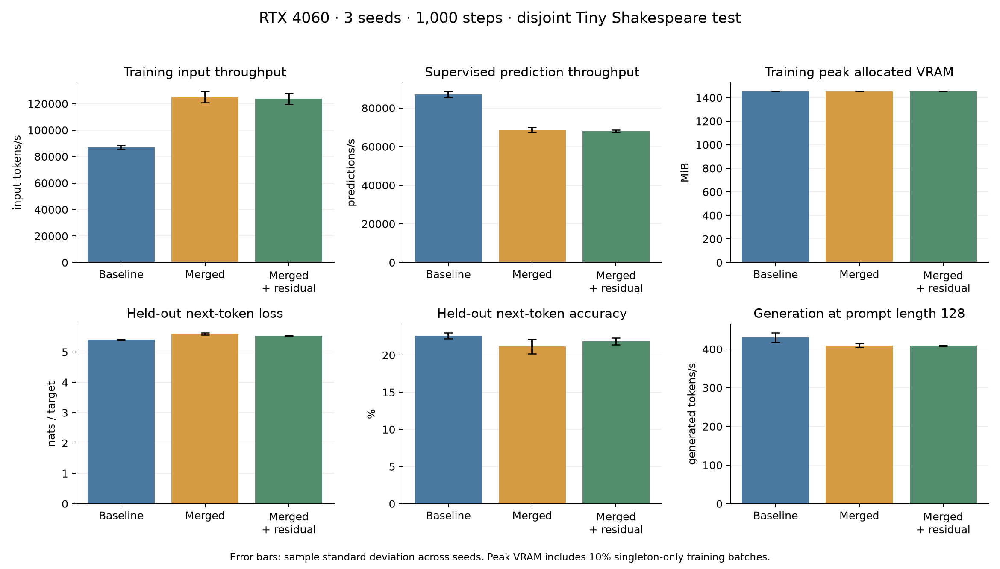
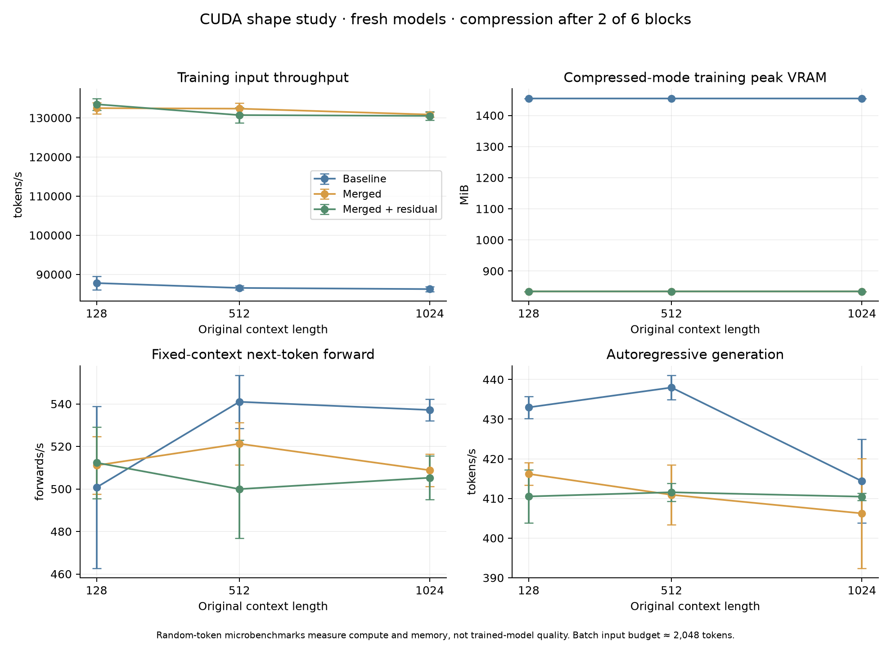

> Historical protocol, revision `3edb3c5`: 10% compression bypass and doubled singleton tails. Current code rejects these settings. These artifacts are preserved, not relabeled as new measurements. See [the always-merged SmolLM2 experiment](smollm-next-experiment.md).

# Measured results: causal token merging with residual aggregation

These are actual local CUDA measurements, not projected gains. The residual configuration improved held-out quality over plain merging in all three tested seeds, while the classical baseline retained better final-prefix quality. It increased training input throughput by about 1.42x. Generation acceleration and a lower mixed-training maximum VRAM were not demonstrated.

## Environment and data

- NVIDIA GeForce RTX 4060, approximately 8 GiB total memory; PyTorch 2.14.0, CUDA build 13.3, NVIDIA driver 615.71.09, Python 3.14.7.
- FP32 parameters and optimizer state, CUDA BF16 autocast, fused AdamW, TF32 enabled, eager execution, automatic SDPA backend selection, no persistent KV cache.
- Tiny Shakespeare from Karpathy's char-rnn repository, GPT-2 BPE (`tiktoken/gpt2`). Raw text is split into contiguous **80% train / 10% validation / 10% test before tokenization**.
- Split sizes: **267,688 train**, **34,279 validation**, **36,059 test** tokens. [Source and exact split hashes](../nanoGPT/data/shakespeare_threeway/manifest.json) are committed; raw text and token binaries are excluded.
- Six blocks, six attention heads, width 192, block size 128, batch size 16, compression after two full-resolution blocks, pairwise merging.
- 1,000 optimizer updates per run, seeds 1337/2027/3407. LR warms up for 50 updates, then follows cosine decay from 0.001 to 0.0001. Dropout 0.1; merged models train 10% singleton-only batches.
- The three variants share the exact common initial weights and input/mode plans within each seed; hashes are checked at runtime. Run order rotates across seeds.

## Primary trained-model comparison

Values are **mean ± sample standard deviation across three seeds**. Training throughput excludes validation and the first ten updates; model timers exclude batch preparation/transfer. End-to-end training-step throughput is also present in the JSON.

| Variant | Train input k tokens/s | Train k predictions/s | Training allocated peak MiB | Test next-token loss | Test accuracy % | Generation tokens/s, prompt 128 |
| --- | ---: | ---: | ---: | ---: | ---: | ---: |
| Classical nanoGPT | 87.1 ± 1.5 | 87.1 ± 1.5 | 1452.5 ± 0.0 | 5.407 ± 0.023 | 22.61 ± 0.40 | 429.9 ± 12.4 |
| Merged, no residual | 125.1 ± 4.1 | 68.7 ± 1.3 | 1452.7 ± 0.2 | 5.601 ± 0.034 | 21.14 ± 0.98 | 409.3 ± 5.0 |
| Merged + residual sum | 123.8 ± 4.1 | 67.9 ± 0.7 | 1452.7 ± 0.2 | 5.533 ± 0.013 | 21.84 ± 0.46 | 408.9 ± 1.8 |



Accuracy is **top-1 next-token accuracy**, not text fluency or an instruction-following benchmark. The primary test metric scores 2,048 fixed final-prefix predictions per run, evenly split between context lengths 128 and 127. These targets are identical across variants and seeds. The table does not describe every token of the entire test split, and repeated model seeds do not create independent test examples.

Loss is mean cross-entropy in nats per sampled target. It is not reported as full-sequence perplexity.

### Matched window-boundary test metrics

All three variants score the same 65,536 boundary/tail predictions drawn from the held-out split. These contexts can overlap and repeat test positions. This metric matches the compressed training objective more closely than final-prefix scoring.

| Variant | Boundary loss | Boundary accuracy % |
| --- | ---: | ---: |
| Classical nanoGPT | 5.356 ± 0.010 | 23.29 ± 0.30 |
| Merged, no residual | 5.404 ± 0.033 | 22.59 ± 0.28 |
| Merged + residual sum | 5.368 ± 0.003 | 23.21 ± 0.10 |

The residual model is close to the baseline on window-boundary accuracy, but its final-prefix metric remains worse. These are different evaluation distributions, not contradictory measurements.

### Tail diagnostic

Each row averages 1,024 final-prefix targets per run for the specified remainder. Remainder 0 uses complete windows; remainder 1 uses a singleton tail. The samples are fixed but different between remainder groups, so their absolute losses cannot isolate a pure tail effect.

| Variant | Length remainder | Prefix loss | Prefix accuracy % |
| --- | ---: | ---: | ---: |
| Classical nanoGPT | 0 | 5.274 | 22.82 |
| Classical nanoGPT | 1 | 5.539 | 22.40 |
| Merged, no residual | 0 | 5.380 | 21.84 |
| Merged, no residual | 1 | 5.823 | 20.44 |
| Merged + residual sum | 0 | 5.300 | 22.66 |
| Merged + residual sum | 1 | 5.766 | 21.03 |

### Paired residual-vs-no-residual differences and training budgets

Negative loss differences and positive accuracy differences favor the residual variant. Both compressed variants have the same supervised-prediction budget within each seed.

| Seed | Prefix loss difference | Accuracy difference, percentage points | Training input tokens, each variant | Baseline predictions | Each merged variant predictions |
| --- | ---: | ---: | ---: | ---: | ---: |
| 1337 | -0.0511 | +0.342 | 2,039,904 | 2,039,904 | 1,115,488 |
| 2027 | -0.0457 | +0.244 | 2,039,888 | 2,039,888 | 1,147,872 |
| 3407 | -0.1077 | +1.514 | 2,040,032 | 2,040,032 | 1,100,176 |

This is consistent evidence for the residual configuration on this dataset and schedule. Three seeds and one dataset do not establish a general quality advantage. The comparison does not separate amplification, restricted relative weights, singleton scaling, and optimization effects. The algebraic equivalence to a rescaled weighted average is [proved separately](proofs.md).

## Why the mixed-training VRAM peak does not fall

With 10% singleton-only batches, both merged models sometimes process the full sequence in all blocks and emit all original-position logits. Their full-run allocated maximum is therefore essentially the baseline's maximum. Average memory might differ, but this benchmark reports the **maximum**, not an average.

Independent-mode measurements below show the potential saving for completed-window batches. To realize a lower full-run maximum while keeping singleton training, one would need a policy such as a smaller singleton-only batch size or gradient accumulation. Such a policy was not implemented or silently applied in these comparisons.

## Context length and compression-depth study

The [scaling report](../results/scaling_cuda.json) contains **69 warmed microbenchmark cases**: three seeds, contexts 128/512/1024, compression before blocks 0/2/4, two compressed variants, a baseline, and isolated singleton-only training controls.

These models are freshly initialized and receive random token IDs. Each case performs five training warmup steps and twenty timed updates. These results establish tensor-shape performance and memory costs, **not** long-context quality of the trained 128-token models. The models have positional capacity 1,024, so their parameter memory is slightly larger than in the primary experiment.

Training batch sizes are 16/4/2 respectively, keeping 2,048 input tokens per update. This makes changes in sequence length explicit without multiplying the total batch-token budget. Fixed-context inference performs 100 warmed next-token forwards; generation samples 32 tokens five times at batch size one. The growing generation prefix crops at 1,024 positions, while fixed-context inference stays at its exact listed length.

The following rows average the three shape-study seeds, with compression after two blocks. Full per-case values, reserved peaks, and variation are retained in the JSON.

| Context | Variant | Train input k tokens/s | Compressed-mode training allocated MiB | Fixed-context forwards/s | Generation tokens/s | Generation allocated MiB |
| --- | --- | ---: | ---: | ---: | ---: | ---: |
| 128 | Classical nanoGPT | 87.8 | 1454.5 | 500.7 | 433.0 | 83.14 |
| 128 | Merged, no residual | 132.5 | 834.5 | 511.1 | 416.2 | 83.09 |
| 128 | Merged + residual sum | 133.5 | 834.5 | 512.3 | 410.5 | 83.09 |
| 512 | Classical nanoGPT | 86.5 | 1454.5 | 541.0 | 438.0 | 84.00 |
| 512 | Merged, no residual | 132.3 | 834.5 | 521.3 | 410.9 | 83.80 |
| 512 | Merged + residual sum | 130.7 | 834.5 | 499.9 | 411.6 | 83.80 |
| 1024 | Classical nanoGPT | 86.2 | 1454.5 | 537.2 | 414.4 | 85.06 |
| 1024 | Merged, no residual | 130.8 | 834.5 | 508.8 | 406.2 | 84.69 |
| 1024 | Merged + residual sum | 130.5 | 834.5 | 505.3 | 410.5 | 84.69 |



Pure compressed batches need about **834.5 MiB vs 1454.5 MiB** for the baseline at this input budget, approximately **42.6% less allocated peak memory**. Singleton-only controls return to approximately **1454.5 MiB**. Residual and no-residual compression have effectively identical memory peaks in these cases.

Generation remains comparable or slower under the tested shapes, with only small allocated-memory savings. Smaller deep sequences alone do not establish faster end-to-end sampling: compression, kernel launch, early-block, vocabulary-projection, and sampling costs also remain. Profiling would be needed to attribute the bottleneck precisely; this report does not claim that a particular component was measured as dominant.

Compression depth at original context 1,024, residual configuration:

| Full-resolution blocks before merge | Train input k tokens/s | Training allocated MiB | Generation tokens/s |
| --- | ---: | ---: | ---: |
| 0 | 134.2 | 819.8 | 411.8 |
| 2 | 130.5 | 834.5 | 410.5 |
| 4 | 127.8 | 849.3 | 394.8 |

These compute-only measurements do not tell us whether earlier compression preserves quality. More blocks before compression change costs, and kernel behavior/hardware can change the results. This release measures one GPU and one model width.

## Memory and timing definitions

Allocated peak means the largest PyTorch tensor-memory allocation reported by `max_memory_allocated`; reserved peak means the largest caching-allocator reservation reported by `max_memory_reserved`. Both are included in the raw artifacts. They differ from total `nvidia-smi` usage, which can include CUDA context/library allocations and other processes. See [PyTorch CUDA memory management](https://docs.pytorch.org/docs/2.14/notes/cuda.html#memory-management), [allocated peak](https://docs.pytorch.org/docs/2.14/generated/torch.cuda.memory.max_memory_allocated.html), and [reserved peak](https://docs.pytorch.org/docs/2.14/generated/torch.cuda.memory.max_memory_reserved.html).

Training memory includes parameters, AdamW state, gradients, and current-step activations/logits. Validation allocations are excluded from training peaks and their unused cached buffers are cleared. Generation runs after freeing the optimizer and gradients. Timers synchronize CUDA before and after measured work; generation warmup is excluded. The desktop was active on the same GPU; order rotation and repetitions reduce but do not eliminate noise.

SDPA selects an implementation according to its inputs and environment; we did not pin or trace a particular backend. See [official SDPA documentation](https://docs.pytorch.org/docs/2.14/generated/torch.nn.functional.scaled_dot_product_attention.html).

## Reproduce the runs

```bash
python -m pip install -r requirements-experiments.txt
python nanoGPT/data/shakespeare_threeway/prepare.py
OMP_NUM_THREADS=4 MKL_NUM_THREADS=4 python nanoGPT/bench_ablation.py --device=cuda --max-iters=1000 --seeds 1337 2027 3407 --prefix-iters=128 --test-iters=64 --output=results/ablation_cuda.json
OMP_NUM_THREADS=4 MKL_NUM_THREADS=4 python experiments/nanogpt/benchmark_scaling.py --output=results/scaling_cuda.json
python experiments/nanogpt/verify_properties.py
python -m unittest discover -s tests -v
MPLCONFIGDIR=/tmp/residual-matplotlib python experiments/reporting/plot_results.py
python experiments/reporting/write_report.py
OMP_NUM_THREADS=4 MKL_NUM_THREADS=4 python experiments/nanogpt/benchmark_scaling.py --output=results/scaling_cuda.json
python experiments/nanogpt/verify_properties.py

MPLCONFIGDIR=/tmp/residual-matplotlib python experiments/reporting/plot_results.py
python experiments/reporting/write_report.py
```

Plotting additionally requires `matplotlib`. GPU access must be available to the process; in the development environment sandbox restrictions hid the GPU, and the actual CUDA runs used execution outside those restrictions. The property checks and CPU entry-point tests do not require GPU access.

## Conclusions supported by this evidence

| Question | Evidence and scope |
| --- | --- |
| Is the residual aggregate lossless? | No on arbitrary hidden states; explicit nullspace/collision proof. This does not determine LM task quality. |
| Is initialization only a scaled mean? | Yes, exactly. Learned weights also give a rescaled constrained weighted average. |
| Is a persistent KV cache implemented? | No; source inspection and runtime prefix-length tracing establish recomputation. |
| Does residual aggregation help held-out quality? | It improves plain merging in all three tested seeds here; it remains below baseline on final-prefix accuracy/loss. |
| Does compression accelerate training? | Yes for input tokens/s here; supervised predictions/s are lower than baseline. |
| Does compression accelerate generation? | Not established here; measurements are mostly slower. |
| Does compression reduce maximum VRAM? | Yes for isolated compressed batches; essentially no for mixed training with full-sized singleton batches. |
| Does cropping change positions and windows? | Yes; traced local indices and absolute window offsets demonstrate the implemented behavior. |
| Do these results establish universal advantages? | No; more datasets, widths, GPUs, seeds, matched-supervision budgets, and mechanism controls are needed. |

Built on [nanoGPT by Andrej Karpathy](https://github.com/karpathy/nanoGPT). Project direction: geomi737; development assisted by Gemini and ChatGPT, including Codex. [Credits](../AUTHORS.md).
