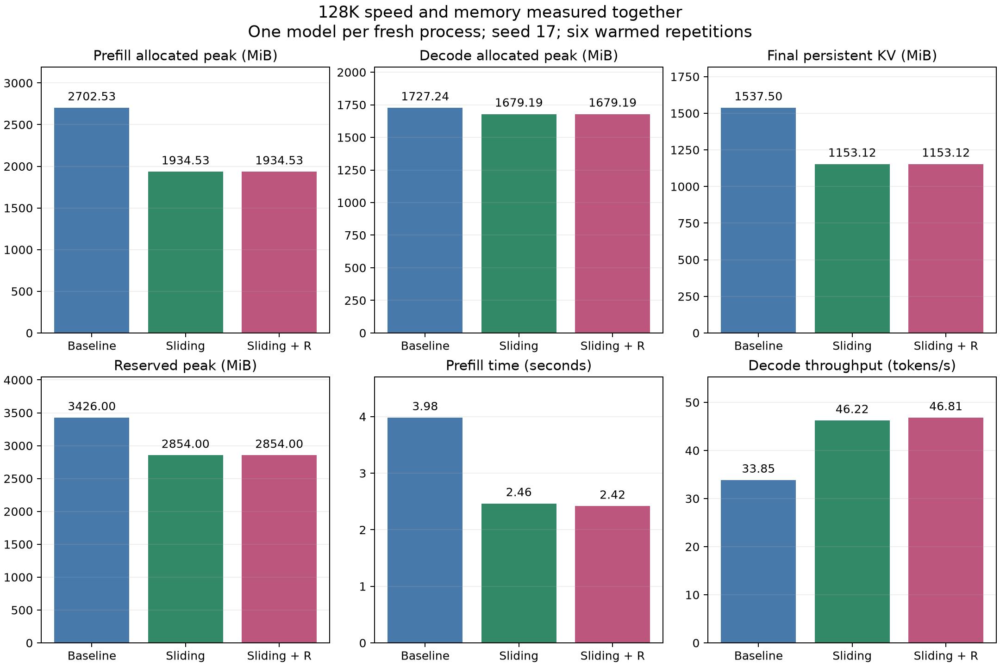

# GPU memory: isolated 128K inference

One model per fresh process, RTX 4060, seed 17, context 131,072, batch one,
FP32 parameters, BF16 autocast, SDPA. Six repetitions after two warmups; 128
new tokens. Allocator peak counters reset separately for prefill and decode.
The allocator stays warm. Speed and memory are measured together.

| MiB | Baseline | Sliding | Sliding + R | Compressed difference |
|---|---:|---:|---:|---:|
| Weights-only allocated | 84.40 | 84.40 | 84.40 | approximately zero |
| Prefill allocated peak | 2702.53 | 1934.53 | 1934.53 | −28.42% |
| Decode allocated peak | 1727.24 | 1679.19 | 1679.19 | −2.78% |
| Reserved peak | 3426 | 2854 | 2854 | −16.70% |
| Final persistent KV | 1537.50 | 1153.12 | 1153.12 | −25.00% |

Both variants accelerate this isolated workload: prefill +61.62%/+64.70%, decode
+36.54%/+38.29%. The memory saving is substantial for prompt processing and
persistent KV, but much smaller for the decode peak.

Persistent KV reduction does not imply equal reduction in whole-model peak.
The decode implementation uses temporary deep-cache records for singleton-tail
prediction; persistent and temporary allocations must be distinguished. This is
a candidate for profiling and optimization, not a quantified allocation-level
explanation from these aggregate peaks alone.

**Allocated** is live PyTorch GPU allocation; **reserved** is memory held by its
allocator, including caching. They must not be added. Neither includes CUDA
context, driver, or other applications. This report does not claim a total-device
or NVML process-memory peak. Weights-only is recorded before the prompt allocation;
decode peaks include existing prompt KV. Cache lengths after decode are 131,200
in all baseline layers, versus 131,200 in four early and 65,600 in four deep
compressed layers.

Dense sliding training did not materially reduce training allocated peaks:
1196.8 MiB baseline, 1198.0 Sliding, 1197.5 Sliding + R across three seeds.

[Joint raw measurements](../../results/memory/128k_isolated/results.json) ·
[All percentages](../../results/memory/128k_isolated/comparison.md) ·
[Protocol](../sliding-multiseed-experiment.md)
