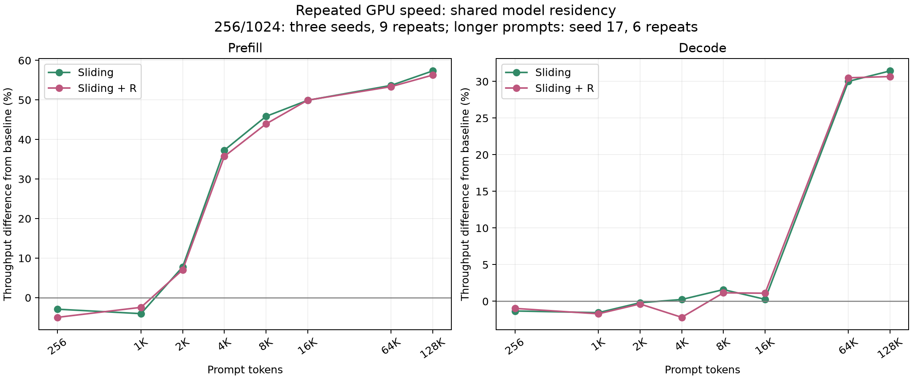

# Inference speed and context length

The original training-adjacent 32-token single timings showed large variability.
They remain in raw evidence but are superseded for speed interpretation by
checkpoint-only benchmarks with warmup, rotated variant order, 128 greedy decode
steps, CUDA synchronization, and repeated timings. All use RTX 4060, FP32 weights,
BF16 autocast, SDPA, and batch one. Throughput is total tokens divided by total time.

## Shared-residency context sweep

| Prompt | Sliding prefill | Sliding + R prefill | Sliding decode | Sliding + R decode |
|---|---:|---:|---:|---:|
| 256 | −2.92% | −4.97% | −1.32% | −0.97% |
| 1024 | −4.04% | −2.45% | −1.55% | −1.71% |
| 2048 | +7.78% | +7.03% | −0.19% | −0.36% |
| 4096 | +37.28% | +35.72% | +0.25% | −2.19% |
| 8192 | +45.84% | +43.93% | +1.60% | +1.16% |
| 16384 | +49.91% | +49.94% | +0.27% | +1.10% |
| 65536 | +53.68% | +53.36% | +30.02% | +30.50% |
| 131072 | +57.34% | +56.29% | +31.44% | +30.67% |

Values are throughput differences from baseline. Short contexts aggregate all
nine repeats across each of three seeds; longer contexts use seed 17 and six
repeats. All three models reside on GPU during each seed. The prefill crossover
is approximately between 1024 and 2048 in these measurements. A substantial
decode advantage is observed by 64K; the exact crossover is not measured.

Prefill reduces both query and history lengths in four deep layers. Decode still
runs all eight layers for one new token, reducing history rather than the number
of per-step layer calls. These structural observations explain why their speed
curves can differ; no kernel-level attribution is claimed without profiling.

## Separate isolated 128K speed and memory test

With one model per fresh process, the joint measurement gives:

| Metric | Baseline | Sliding | Sliding + R |
|---|---:|---:|---:|
| Prefill time (s) | 3.9813 | 2.4634 | 2.4174 |
| Prefill throughput difference | reference | +61.62% | +64.70% |
| Decode tokens/s | 33.85 | 46.22 | 46.81 |
| Decode throughput difference | reference | +36.54% | +38.29% |

These are a separate sequential benchmark, not pooled with the shared-residency
sweep. Device conditions and allocation residency differ. Small Sliding/+R speed
differences do not establish an architecture winner. Warmup and repetition do
not eliminate background load or GPU-clock changes. Long-context quality was
not tested; models were trained on 255/256-token sequences.

[All speed evidence](../../results/README.md) ·
[Isolated joint report](../../results/memory/128k_isolated/comparison.md) ·
[Reproduction](../sliding-multiseed-experiment.md)
