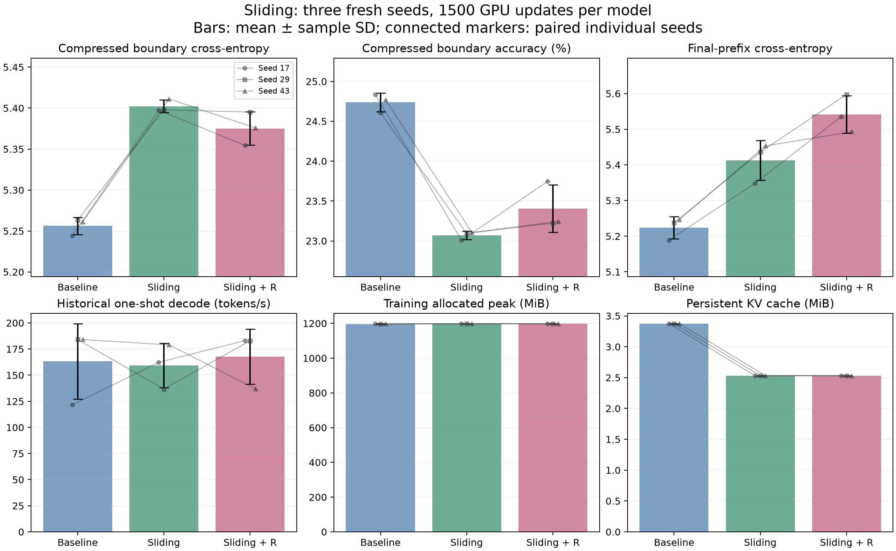
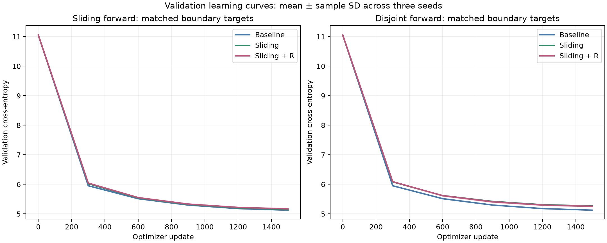

# Training and quality: three fresh seeds

Nine models were trained from scratch on GPU: Baseline, Sliding, and Sliding + R
for seeds 17, 29, and 43. Each received 1500 optimizer updates and 6,132,000 input
and supervised tokens, about 2.41 corpus-token volumes sampled as random windows.
Within each seed, base weights and training batches are paired. This repeats
initialization, not a fresh dataset evaluation. The seed-11 pilot is excluded.

| Compressed inference metric | Baseline | Sliding | Sliding + R |
|---|---:|---:|---:|
| Boundary accuracy (%) | 24.738 ± 0.118 | 23.069 ± 0.053 | 23.405 ± 0.297 |
| Boundary cross-entropy | 5.2562 ± 0.0104 | 5.4022 ± 0.0077 | 5.3751 ± 0.0204 |
| Final-prefix cross-entropy | 5.2241 ± 0.0309 | 5.4127 ± 0.0560 | 5.5419 ± 0.0527 |

Values are mean ± sample SD across seeds. Relative to paired baseline, Sliding
boundary loss is 2.78% higher and accuracy is 1.67 percentage points lower;
Sliding + R loss is 2.26% higher and accuracy is 1.33 points lower.

Sliding + R improves compressed boundary accuracy over Sliding in all three
seeds, averaging +0.336 points, and lowers boundary loss by 0.50%. However,
final-prefix loss is 2.40% higher in all three seeds. There is no overall quality
winner among the compressed variants; baseline remains the best quality control.

Dense sliding-mode boundary accuracy is only 0.30 points below baseline for
Sliding and 0.49 points below for Sliding + R. The larger compressed-mode deficit
suggests that the overlapping-training/disjoint-inference transition contributes
to quality loss; it does not isolate that mechanism experimentally.

The overview retains the historical one-shot decode timings for completeness;
use the separate [repeated speed report](speed.md) for performance conclusions.

[All metrics and paired differences](../../results/training/three_seeds/comparison.md) ·
[Raw runs](../../results/training/three_seeds/results.json) ·
[Protocol](../sliding-multiseed-experiment.md)

The corpus is small, training contexts are 255/256, and the test split was already
inspected in the pilot. Three seeds provide a limited stability check, not a
confidence interval or evidence of general reasoning or long-context quality.
