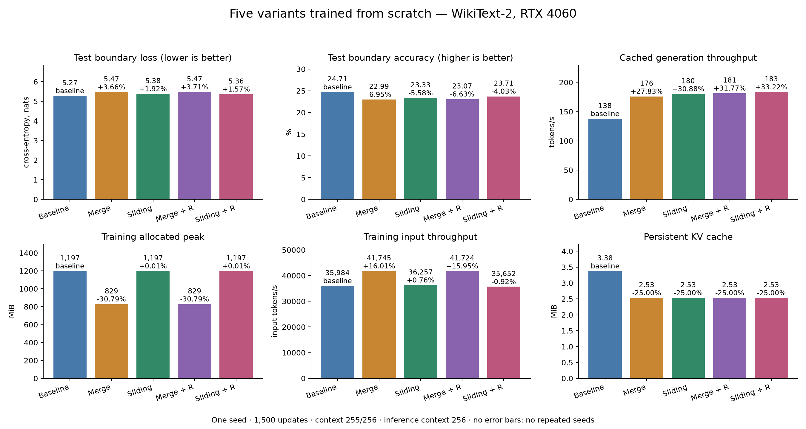
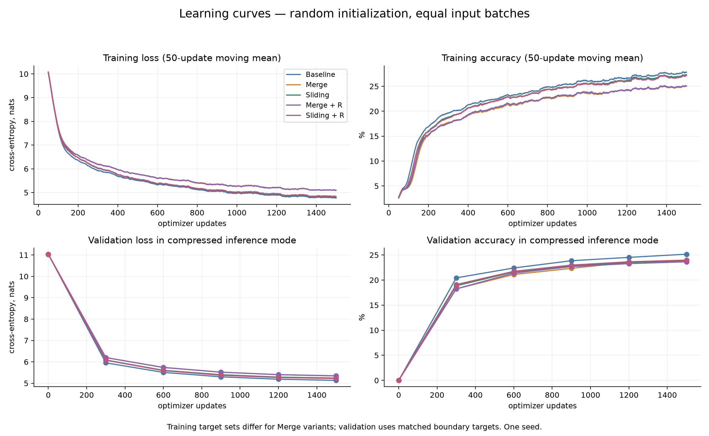
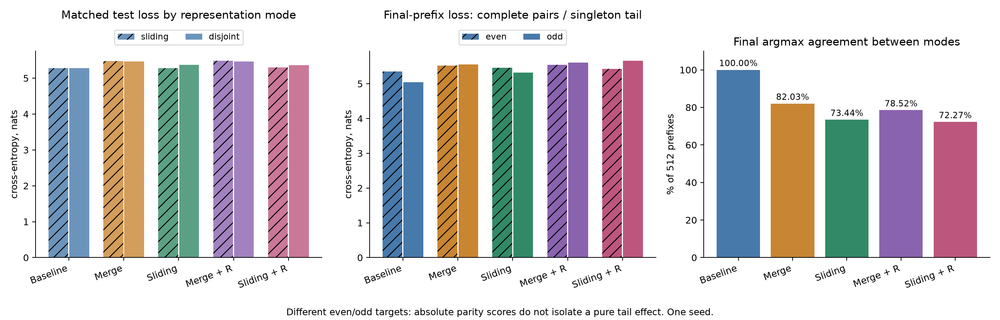

# Sliding training with compressed inference: scratch GPU pilot

This is the historical seed-11 pilot. See the newer [training](reports/training.md),
[speed](reports/speed.md), and [memory](reports/memory.md) reports. Short one-shot
inference timings here do not establish a stable speedup.


**Status:** completed pilot; one seed. **Date:** 2026-09-18.
**Selected direction:** Sliding + residual, based on compressed boundary accuracy.
The baseline remains better on the measured quality metrics. This selection is
an author research preference, not proof of universal model superiority.

## Question and result

Can a model trained from scratch on overlapping causal merged representations
use non-overlapping compressed history at inference without an unmerge stage?
In this pilot, Sliding + R retained boundary accuracy within **0.99 percentage
points** of baseline and had **1.57% higher boundary CE**, with **33.22% higher
measured cached decode throughput**. Sliding without R had better final-prefix
CE. Repeated seeds and longer-context measurements remain necessary.



## Architecture and five variants

All variants use the same random-initialized Llama base: 8 layers, width 288,
MLP width 768, 6 query heads, 3 KV heads, vocabulary 49,152, tied embeddings.
The base has **22,123,296 parameters**; merged variants add two learned weights.
The configuration and tokenizer come from SmolLM2, but **no pretrained model
weights are loaded**. All base parameters are trainable. Merge precedes block
index 4: four early blocks are full resolution and four deep blocks follow it.
SDPA causal attention and original-position RoPE are used.

Let `x[t]` be a contextual state after the early blocks, and `a = softmax(w)`.
Weighted pairs and residual pairs are:

```text
M(u,v) = a[0] * u + a[1] * v
C(u,v) = M(u,v) + u + v
```

| Variant | Training sequence | Inference sequence | Training targets |
|---|---|---|---|
| Baseline | Individual states | Individual states | Every next token |
| Conventional merge | Non-overlapping M pairs | Non-overlapping M pairs | Endpoints and singleton tail |
| Sliding | x[0], M(x[0],x[1]), M(x[1],x[2]), ... | Non-overlapping M pairs | Every next token |
| Conventional merge + R | Non-overlapping C pairs | Non-overlapping C pairs | Endpoints and singleton tail |
| Sliding + R | x[0], C(x[0],x[1]), C(x[1],x[2]), ... | Non-overlapping C pairs | Every next token |

Sliding aggregates original adjacent states simultaneously. It does not recurse
through previous merged outputs. Its first state and any disjoint incomplete
tail remain unchanged. Training is causal: position t uses no states after t,
and predicts token t+1. Disjoint pair endpoints predict only the token after the
window, never an internal token. There is no unmerge or dense reconstruction.

Standard attention/MLP residual connections remain in every Transformer block.
The additional constituent sum is applied once at merge. At uniform weights,
C is three times the pair mean, not an independent memory of both constituents.
Its normalized coefficients are `(1+a[i])/3`. See [proofs](proofs.md).

Sliding preserves training length T. Disjoint inference length is
`floor(T/2) + T%2`. Early-layer caches retain all token K/V. Deep-layer
persistent caches retain completed pairs only. A singleton still participates
in the current prediction through temporary deep KV records, and its pre-merge
state is retained until its partner arrives. Odd prefill produces logits and
then crops singleton deep records; singleton decode updates copied cache
records. Incomplete states are not discarded from computation.

## Data and training budget

Data: official WikiText-2 raw splits, with exact-article deduplication across
splits in test/validation/train order. The same token files are used by every
variant. Articles have EOS boundaries; sampled fragments can cross them.

| Split | Token count |
|---|---:|
| Train | 2,543,764 |
| Validation | 265,742 |
| Test | 302,010 |

See [original data metadata](../results/training/seed11_pilot/dataset_manifest.json)
and [source credits](../UPSTREAM.md). The metadata's adaptation note comes from
an older workflow; it does not describe this scratch initialization.

- Seed 11; 1,500 optimizer updates per variant.
- Length alternates 255/256; microbatch 4; accumulation 4.
- Every variant processes **6,132,000 original input tokens**.
- Baseline/sliding variants supervise **6,132,000 predictions**; conventional
  merge variants supervise **3,072,000** (49.90% fewer).
- FP32 parameters and AdamW state, BF16 autocast, CUDA SDPA; no checkpointing.
- AdamW, peak LR 0.0005, default betas (0.9, 0.999), epsilon 1e-8,
  weight decay 0.01, `foreach=False`, gradient clipping norm 1.
- The exact LR is `peak * min(1, step/150) * (0.1 + 0.9*0.5*(1+cos(pi*step/1500)))`.
- Validation every 300 updates on 128 final prefixes. Final test: 512 final
  prefixes and 65,536 common boundary/tail targets.
- The fixed final checkpoint is evaluated; test is not used to tune this run.
- Base-initialization hashes, batch-plan hashes, and input counts are verified
  equal. Checkpoints, JSON progress and generated local reports remain under
  ignored `out-sliding-scratch-smollm/`.

Conventional merging does not slow learning by hundreds of times. It supplies
about half the predictions per update here; its actual convergence tradeoff is
not isolated by an equal-input-budget run. Equal-prediction and equal-wall-time
comparisons would answer different questions.

## Matched held-out quality

All table values use **compressed inference** and the same targets.

| Variant | Boundary CE | CE change vs baseline | Boundary accuracy | Accuracy change, pp | Final-prefix CE | Final-prefix accuracy |
|---|---:|---:|---:|---:|---:|---:|
| Baseline | 5.2743 | reference | 24.71% | reference | 5.2001 | 24.41% |
| Merge | 5.4673 | +3.66% | 22.99% | -1.72 | 5.5434 | 22.66% |
| Sliding | 5.3758 | +1.92% | 23.33% | -1.38 | **5.3895** | 22.66% |
| Merge + R | 5.4697 | +3.71% | 23.07% | -1.64 | 5.5791 | 22.27% |
| Sliding + R | **5.3573** | **+1.57%** | **23.71%** | **-0.99** | 5.5407 | 22.46% |

Bold identifies the best merged boundary/final-prefix CE, not a win over
baseline. Boundary CE measures distribution quality; accuracy measures top-1
choices. Neither alone establishes general understanding or reasoning quality.
These are sampled prediction scores, not full-sequence perplexity.

Sliding + R reduces the conventional-merge boundary CE gap by about **57.00%**;
Sliding without R reduces it by **47.39%**. Additional residual aggregation
slightly helps sliding boundary quality, but does not consistently help
final-prefix quality. Conventional merge + R is effectively tied with plain
merge here. One seed cannot establish significance of these small differences.

## Speed and memory



| Variant | Training input tokens/s | Change | Training allocated peak MiB | Change | Cached decode tokens/s | Change |
|---|---:|---:|---:|---:|---:|---:|
| Baseline | 35,984 | reference | 1197.1 | reference | 137.65 | reference |
| Merge | 41,745 | +16.01% | 828.6 | -30.79% | 175.96 | +27.83% |
| Sliding | 36,257 | +0.76% | 1197.3 | +0.01% | 180.16 | +30.88% |
| Merge + R | 41,724 | +15.95% | 828.6 | -30.79% | 181.39 | +31.77% |
| Sliding + R | 35,652 | -0.92% | 1197.3 | +0.01% | 183.39 | +33.22% |

Training rates aggregate input counts divided by elapsed update time after the
first three updates. Timings include accuracy collection and optimizer work,
exclude validation. Sliding supplies dense targets with essentially baseline
training memory and speed. Conventional merging reduces training allocated
peak but has fewer predictions; predictions/s is about 41.9% below baseline.

Inference is measured without optimizer states, batch one, prompt 256,
greedy decode 32 tokens. Full forward uses three timed repeats after warmup.
Cached prefill and decode have one timed case per variant. Full forward projects
all output logits; cached prefill projects only the last state. Free allocator
blocks are released before cases. GPU timings use synchronization.

- Full-forward allocated peak: **167.27 → 155.05 MiB**, a **7.30%** reduction.
- Cached-prefill allocated peak: **146.22 → 145.33 MiB**, about **0.61%** lower.
- Cached-decode allocated peak: **146.54 → 146.42 MiB**, about **0.08%** lower.
- Persistent KV bytes: **3.375 → 2.531 MiB**, exactly **25%** lower.
- Cache lengths after decode: baseline has eight 288-entry layers; merged models
  have four 288-entry early layers and four 144-entry deep layers.
- Cached-prefill time is 33–37% lower; full-forward latency is nearly unchanged.

Weights, full-resolution early layers and temporary buffers explain why the
short-context total VRAM saving is small. KV bytes are the direct cache-saving
measurement. Reserved memory depends on allocator history and is not the same
as live memory. All raw reserved/allocated cases are in the percentage report.

## Overlapping-history mismatch



Both representation modes are evaluated with dropout disabled. Matched boundary
CE for Sliding rises **1.82%** when moving from sliding history to disjoint
history; Sliding + R rises **1.04%**. Their final argmax agreements between modes
are **73.44%** and **72.27%**, respectively. These agreement rates are not
accuracy: a changed prediction can be either better or worse.

Sliding without R in its dense mode has boundary CE only **0.10%** above
baseline; compressed mode is **1.92%** above baseline. This supports further
study of the train/inference mismatch, not a claim that attention is invariant
to compression. Even/odd prefix samples differ, so parity scores do not isolate
a pure singleton effect.

## Reproduction

Use a CUDA PyTorch installation, then follow the pinned data/configuration
commands in the [root README](../README.md#run-the-current-experiment).
Download configuration/tokenizer assets only; no pretrained model weights are
needed. Run from the repository root:

```bash
python experiments/smollm/train_sliding.py --from-scratch --device cuda \
  --variants baseline disjoint sliding disjoint_residual sliding_residual \
  --seed 11 --merge-layer 4 --steps 1500 --length 256 --batch-size 4 \
  --accumulation 4 --lr 0.0005 --eval-every 300 --eval-batches 16 \
  --test-batches 64 --bench-repeats 3 --decode-tokens 32 \
  --output out-sliding-scratch-smollm
python experiments/smollm/serve_smollm.py --output out-sliding-scratch-smollm --port 8767
```

The runner now defaults to baseline, Sliding, and Sliding + R for new work.
Conventional disjoint merging and Disjoint + R training are legacy. The explicit
five-variant command reproduces the preserved comparison. It fails without
CUDA rather than training on CPU. Atomic JSON progress updates every step; the
English dashboard polls every two seconds. `comparison.md` is generated after
all runs and pairing checks succeed.

Recreate derived published artifacts without training or CUDA:

```bash
python experiments/reporting/export_sliding_analysis.py
MPLCONFIGDIR=/tmp/residual-matplotlib python experiments/reporting/plot_sliding_results.py
python -m unittest discover -s tests -v
```

[Every metric and relative percentage](../results/training/seed11_pilot/percentage_analysis.md) ·
[Machine-readable derived metrics](../results/training/seed11_pilot/percentage_analysis.json) ·
[Exact raw run JSON](../results/training/seed11_pilot/seed11.json) ·
[Artifact checksums](../results/training/seed11_pilot/provenance.json)

## Limitations and next work

This is one seed on a small corpus and a short context. Timing comparisons are
sequential, brief, and share a process/device; repeated measurements are needed
before attributing small differences among merged models to architecture.
Overlapping evaluation windows do not create independent samples. No reasoning,
retrieval, or generated-text preference benchmark is included. Selecting Sliding
+ R after inspecting this test is an exploratory research choice; confirm it on
fresh held-out evaluation in future work.

Next: repeat baseline, Sliding, and Sliding + R across seeds, measure longer-context
memory and cached decoding, and examine retention of distant facts. Compare
the two active sliding variants to test whether the residual sum contributes. Retain
conventional merge results as controls without repeating them by default.

## Acknowledgments

Thank you to the SmolLM2 authors and Hugging Face for the model configuration,
tokenizer and Transformers implementation; to Stephen Merity, Caiming Xiong,
James Bradbury, Richard Socher, Salesforce Research and Wikipedia contributors
for WikiText; and to Andrej Karpathy for nanoGPT and the project's original
experimental foundation. [Pinned provenance and licensing](../UPSTREAM.md).
